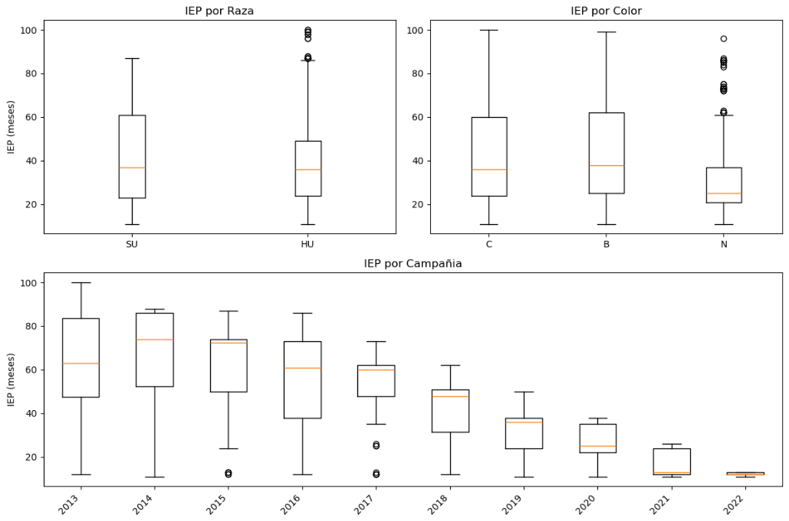
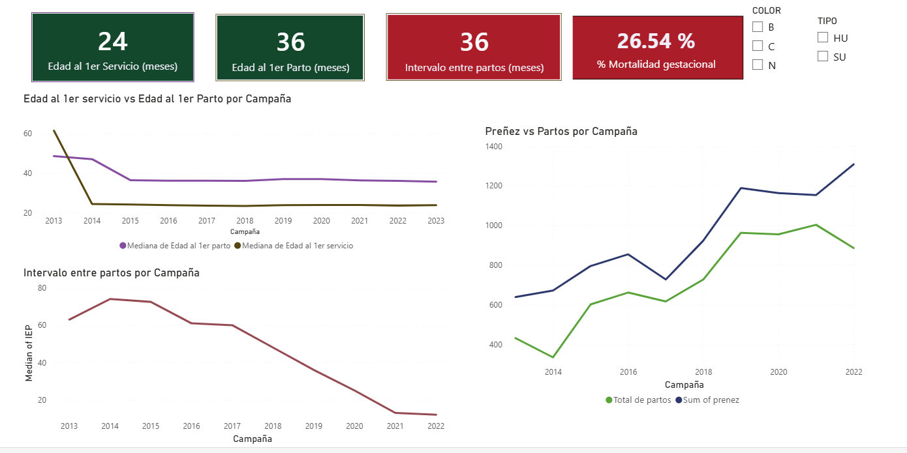

# Alpacas-Reproductive-Analysis
Análisis de eficiencia reproductiva en alpacas usando Python y SQL. Alpaca reproductive efficiency analysis using Python and SQL.

## 🛠️ Ficha Técnica | Technical Specifications

| Concepto / Concept | Detalle / Detail |
| :--- | :--- |
| **Población / Population** | +11,000 registros de alpacas (Servicios y Partos) |
| **Stack Tecnológico** | Python (Pandas, Scipy), SQL (SQLite), Power bi |
| **Análisis Estadístico** | Kruskal-Wallis, Regresión Logística, EDA |
| **KPIs Analizados** | IEP (ICI), E1S (AFS), E1P (AFB), Tasas de Partos |
| **Criterio Profesional** | Validación biológica de gestación (11 ± 1 meses) |

---

## 📈 Resumen de Resultados | Executive Summary

*El presente análisis demuestra una transición exitosa de un manejo tradicional hacia un sistema de alta eficiencia técnica.*
> *This analysis demonstrates a successful transition from traditional management to a high-efficiency technical system.*

### Conclusiones Clave / Key Findings:
1. **Reducción del IEP:** Estabilización en un ciclo óptimo de 12-14 meses para el año 2022.
   > *ICI reduction to an optimal 12-14 month cycle by 2022.*
2. **Influencia del Color:** Superioridad estadística en la tasa de partos para el color Negro (N).
   > *Statistical superiority in birth rates for Black (N) alpacas.*
3. **Brecha de Eficiencia:** Identificación de un 26.5% de pérdida gestacional como punto crítico de intervención.
   > *26.5% gestational loss identified as a critical intervention point.
   
   

   ---

## 📊 Visualización de Datos | Business Intelligence (Power BI)

Se ha desarrollado un dashboard interactivo para la monitorización en tiempo real de los indicadores reproductivos críticos.
> *An interactive dashboard has been developed for the real-time monitoring of critical reproductive indicators*

### Indicadores de Control y Umbrales | Control Indicators and Thresholds:
* **Mortalidad Gestacional:** Configurada con alertas críticas (Rojo > 15%).
  > *Gestational Mortality: Configured with critical alerts (Red > 15%) to identify points for immediate intervention*
* **Edad al 1er Servicio (E1S):** Meta óptima de 12-24 meses para maximizar la vida productiva.
  > *Age at First Service (AFS/E1S): Optimal target of 12-24 months to maximize productive life*
* **Edad al 1er Parto (E1P):** Estabilización lograda en ~36 meses, validando la madurez de las hembras.
  > *Age at First Birthing (AFB/E1P): Stabilization achieved at ~36 months, validating female maturity.*
* **Intervalo Entre Partos (IEP):** Seguimiento de la transición hacia el ciclo ideal de 12 meses  (una cría por año).
  > *Inter-Calving Interval (ICI/IEP): Monitoring the transition toward the ideal 12-month cycle (one offspring per year).*

### Captura del Dashboard | Dashboard caption:

> **Nota:** sobre interactividad: Debido a políticas de privacidad de la cuenta institucional, el dashboard interactivo se encuentra disponible mediante la descarga del archivo .pbix incluido en este repositorio.

> *Note on interactivity: Due to institutional account privacy policies, the interactive dashboard is available by downloading the .pbix file included in this repository.*
   
